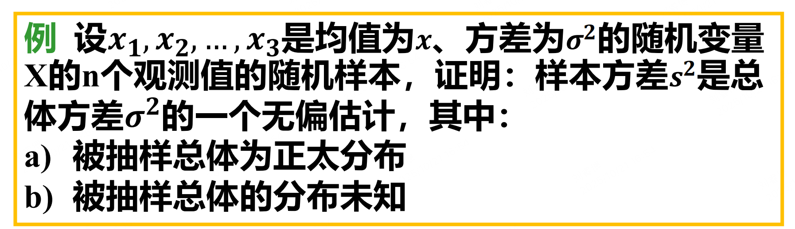
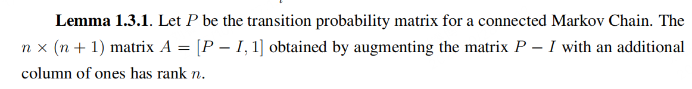
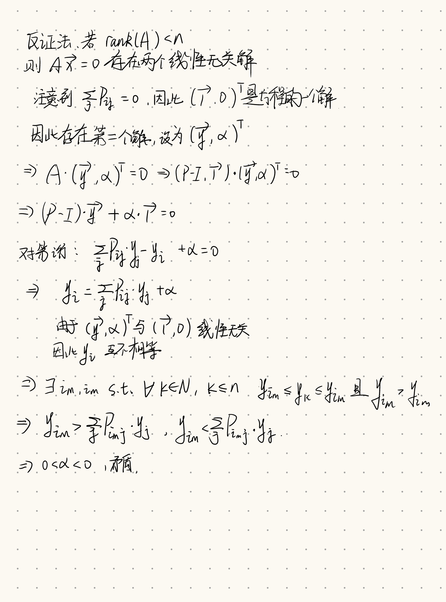
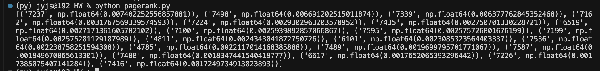

# HW1

1. 已知某工厂某批次水泥重量服从正态分布，总体方差为2.65公斤， 从该工厂随机抽取 18 袋水泥，其平均重量为24.9公斤， 试求该工厂水泥平均重量的95%和99%的置信区间。

$$
SE_X=\frac{\sigma}{\sqrt n}=\frac{\sqrt{2.65}}{\sqrt{18}}=0.38\\
\text{95\%置信区间的显著性水平}\alpha=0.05,Z_{\alpha/2}=1.96\\
95\%置信区间为：24.9-1.96\times0.38\le u\le24.9+1.96\times0.38,即[24.16,25.64]\\
\\
\\
\text{99\%置信区间的显著性水平}\alpha=0.01,Z_{\alpha/2}=2.58\\
99\%置信区间为：24.9-2.58\times0.38\le u\le24.9+2.58\times0.38,即[23.92,25.88]\\
$$

2. 从某学校抽取20名高一学生，经测量 ，这 20名学生的平均身高为155cm，标准差为10cm， 假设平均身高服从正态分布，试求该学校高一学生总平均身高的95%和99%的置信区间。

$$
SE_X=\frac{S}{\sqrt{n-1}}=\frac{10}{\sqrt{19}}=2.29\\
t_{0.05/2(19)}=2.093,t_{0.01/2(19)}=2.861\\
95\%置信区间为：155-2.093\times2.29\le u\le 155+2.093\times2.29,即[150.21,159.79]\\
99\%置信区间为：155-2.861\times2.29\le u\le 155+2.861\times2.29,即[148.45,161.55]
$$

3. 1.2 节P19，证明被抽样总体分布未知情况下的无偏估计。


$$
\begin{aligned}
	设&样本均值为\mu\\
	\\
	s^2&=\frac{\Sigma(x_i- \mu)^2}{n-1}\\
	&=\frac{\Sigma(x_i-x)^2+2(x-\mu)\times\Sigma(x_i-x)+n(\mu-x)^2}{n-1}\\
	&=\frac{\Sigma(x_i-x)^2+2(x-\mu)\times(n(\mu-x))+n(\mu-x)^2}{n-1}\\
	&=\frac{\Sigma(x_i-x)^2-n(x-\mu)^2}{n-1}\\
	\\
	E[(x-\mu)^2]&=Var[x-\mu]+([E(x-\mu)]^2)\\
	&=Var[\frac{\Sigma(x-x_i)}n]+(x-\frac{Ex_i}{n})^2\\
	&=\frac{\Sigma Var[x_i-x]}{n^2}+(x-\frac{nx}{n})^2\\
	&=\frac{n\sigma^2}{n^2}\\
	&=\frac{\sigma^2}n\\
	E[s^2]&=E[\frac{\Sigma(x_i-x)^2-n(x-\mu)^2}{n-1}]\\
	&=\frac{n\times (E[\frac{\Sigma(x_i-x)^2}{n}]-E[\mu-x]^2)}{n-1}\\
	&=\frac{n\times \sigma^2-n\times \frac{\sigma^2}n}{n-1}\\
	&=\sigma^2
\end{aligned}
$$

4. 证明Lemma 1.3.1





---

实验1: PageRank最高20份node:



实验2:

结果统计:

```
recall: 0.6818181818181818
precision: 0.5284974093264249
f1 score: 0.5954465849387041
```

实验代码在压缩包中

